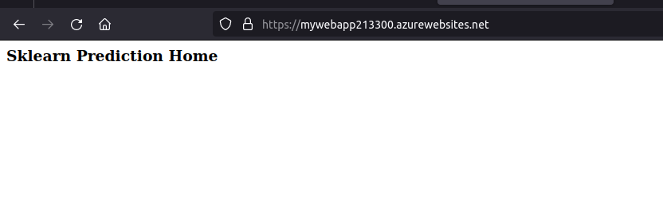
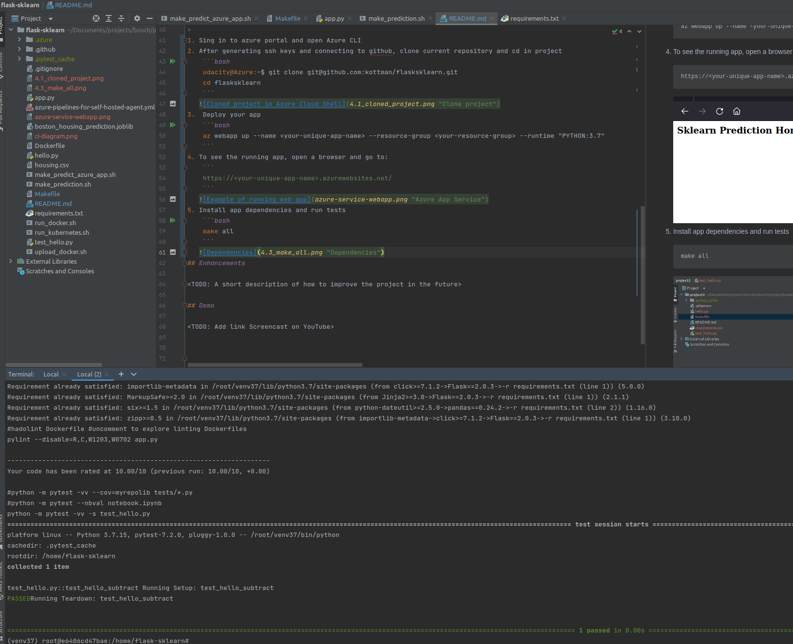
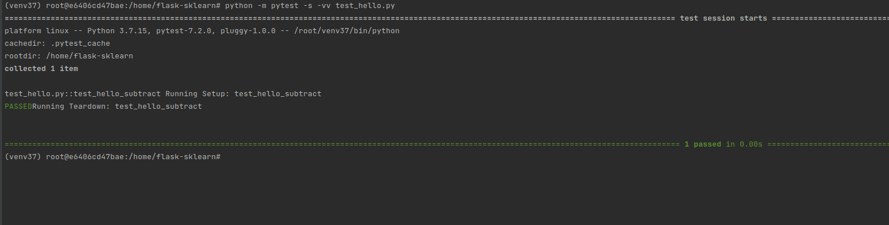
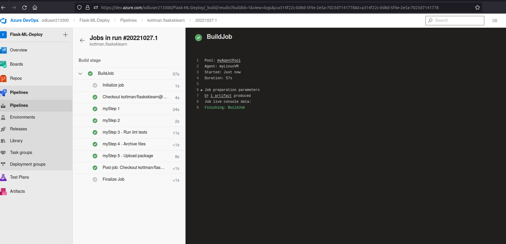
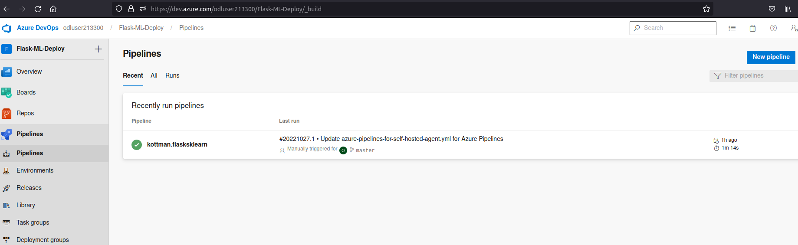
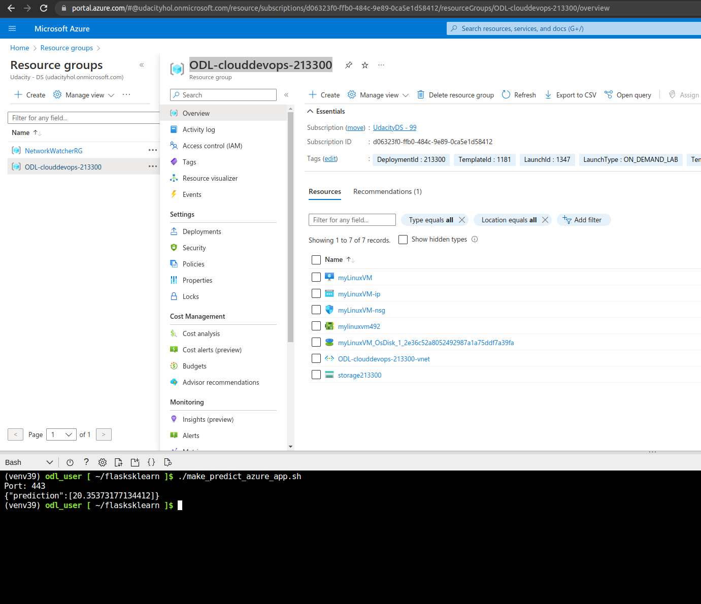
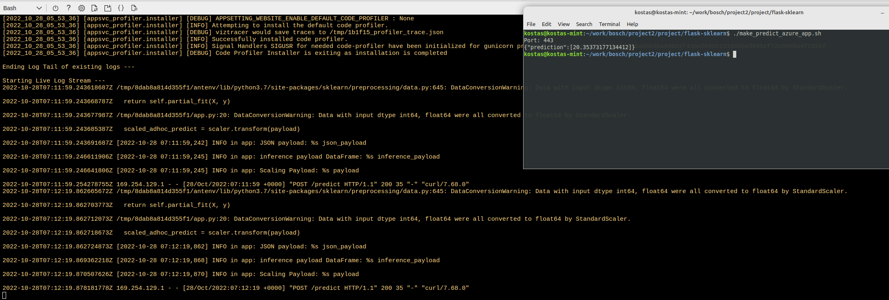

# Overview

A basic python3.7 Flask application is used to demonstrate the CI/CD process using github actions and azure pipelines.

## Project Plan
Project Plan

* [Trello](https://trello.com/b/hkCyLyTn/udacity)
* [Spreadsheet plan](https://docs.google.com/spreadsheets/d/1Gi1TTtdu2XclJLVrJn2Y83IPgHYLP2zEqJ7EX-CPxGE/edit?usp=sharing)

## Instructions
Following diagram illustrates the structure: 

* 

## Prerequisites
1. You should have an account on https://portal.azure.com/ and https://dev.azure.com/.
1. You should have a publicly visible DevOps project, say Flask-ML-Deploy, available in your DevOps account.
1. Your DevOps project should have a service connection created using the Azure Resource Manager and Service principal (manual).
1. Your DevOps project should have a Azure Pipeline Agent setup.

## Instructions
1. Sing in to azure portal and open Azure CLI
2. After generating ssh keys and connecting to github, clone current repository and cd in project
    ```bash
    udacity@Azure:~$ git clone git@github.com:kottman/flasksklearn.git
    cd flasksklearn
    ```
   
3.  Deploy your app
    ```bash
    az webapp up --name <your-unique-app-name> --resource-group <your-resource-group> --runtime "PYTHON:3.7"
    ```
4. To see the running app, open a browser and go to:
    ```
    https://<your-unique-app-name>.azurewebsites.net/
    ```
   
5. Activate virtual environment and install app dependencies and run tests
    ```bash
    make all
    ```
   
6. Run specific test
   ```bash
   python -m pytest -s -vv test_hello.py
   ```
   
7. In Azure DevOpes Services setup automatic deployment using pipeline. Use `https://github.com/kottman/flasksklearn/blob/master/azure-pipelines-for-self-hosted-agent.yml`
as `yml`
8. Do a test commit to verify auto-deployment is running
    
   
9. Verify successful prediction
   
10. Stream logs
   
## Enhancements

Future versions should support latest python version.

## Demo 

<TODO: Add link Screencast on YouTube>


