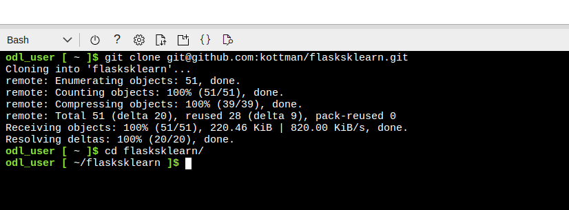

# Overview

A basic python Flask application is used to demonstrate the CI/CD process using github actions and azure pipelines.

## Project Plan
Project Plan

* [Trello](https://trello.com/b/hkCyLyTn/udacity)
* [Spreadsheet plan](https://docs.google.com/spreadsheets/d/1Gi1TTtdu2XclJLVrJn2Y83IPgHYLP2zEqJ7EX-CPxGE/edit#gid=1348135932)

## Instructions
Following diagram illustrates the structure: 

* 

<TODO:  Instructions for running the Python project.  How could a user with no context run this project without asking you for any help.  Include screenshots with explicit steps to create that work. Be sure to at least include the following screenshots:

* Project running on Azure App Service

* Project cloned into Azure Cloud Shell

* Passing tests that are displayed after running the `make all` command from the `Makefile`

* Output of a test run

* Successful deploy of the project in Azure Pipelines.  [Note the official documentation should be referred to and double checked as you setup CI/CD](https://docs.microsoft.com/en-us/azure/devops/pipelines/ecosystems/python-webapp?view=azure-devops).

* Running Azure App Service from Azure Pipelines automatic deployment

* Successful prediction from deployed flask app in Azure Cloud Shell.  [Use this file as a template for the deployed prediction](https://github.com/udacity/nd082-Azure-Cloud-DevOps-Starter-Code/blob/master/C2-AgileDevelopmentwithAzure/project/starter_files/flask-sklearn/make_predict_azure_app.sh).
The output should look similar to this:

```bash
udacity@Azure:~$ ./make_predict_azure_app.sh
Port: 443
{"prediction":[20.35373177134412]}
```

* Output of streamed log files from deployed application

> 
## Prerequisites
1. You should have an account on https://portal.azure.com/ and https://dev.azure.com/.
1. You should have a publicly visible DevOps project, say Flask-ML-Deploy, available in your DevOps account.
1. Your DevOps project should have a service connection created using the Azure Resource Manager and Service principal (manual).
1. Your DevOps project should have a Azure Pipeline Agent setup.

## Instructions
1. Sing in to azure portal and open Azure CLI
2. After generating ssh keys and connecting to github, clone current repository and cd in project
    ```bash
    udacity@Azure:~$ git clone git@github.com:kottman/flasksklearn.git
    cd flasksklearn
    ```
   
3.  Deploy your app
    ```bash
    az webapp up --name <your-unique-app-name> --resource-group <your-resource-group> --runtime "PYTHON:3.7"
    ```
4. To see the running app, open a browser and go to:
    ```
    https://<your-unique-app-name>.azurewebsites.net/
    ```
   
5. Activate virtual environment and install app dependencies and run tests
    ```bash
    make all
    ```
   
6. Run specific test
   ```bash
   python -m pytest -s -vv test_hello.py
   ```
   
7. In Azure DevOpes Services setup automatic deployment using pipeline. Use `https://github.com/kottman/flasksklearn/blob/master/azure-pipelines-for-self-hosted-agent.yml`
as `yml`
8. Do a test commit to verify auto-deployment is running
    
   
9. Verify successful prediction
   
## Enhancements

Future versions should support latest python version.

## Demo 

<TODO: Add link Screencast on YouTube>


